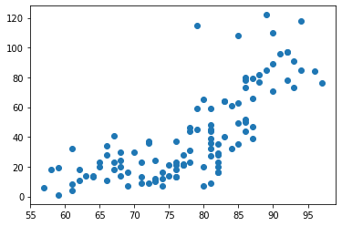

## Tensorflow

#### linear Regression을 활용해 머신러닝 구현하기

> 모듈 import 및 training data set 생성

```python
import tensorflow as tf
x_data = [1,2,3]
y_data = [3,5,7]
```

> placeholder에 값 임시 저장: tf 그래프에 입력을 주기위한 parameter 역할

```Python
x = tf.placeholder(dtype=tf.float32)
y = tf.placeholder(dtype=tf.float32)
```

> Weight, bias 생성 및 가설 제시

```python
W = tf.Variable(tf.random_normal([1]),name = "weight")
b = tf.Variable(tf.random_normal([1]),name = "bias")

H = W * x + b
```

> cost function(loss function) 알아내자
>
> : 가설에서 y값을 빼서 그 값을 제곱해서 평균구하기
>
> tf의 `reduce_mean`함수 활용

```python
cost = tf.reduce_mean(tf.square(H-y))
```

> Train node 생성
>
> : cost 함수를 미분
>
> : 미분을 통해 인접한 직선을 구해서 기울기를 찾는다.

```python
optimizer = tf.train.GradientDescentOptimizer(learning_rate = 0.01) 
# learning rate =얼마나움직일지 알려주는 값, 경험을 통해 스스로 알아내야
# 보통은 0.01
train = optimizer.minimize(cost)
```

> 그래프를 실행시키기 위해서 runner(session)이 필요
>
> : Variable을 사용하면 학습하기 전에 반드시 초기화 필요!

```python
sess = tf.Session()
sess.run(tf.global_variables_initializer())
```

> learning 학습

```python
for step in range(3000):
    empty,w_val, cost_val,b_val = sess.run([train,W,cost,b],
                                      feed_dict={
                                          x : x_data,
                                          y : y_data
                                      })
    if step % 300 ==0:
        print("w값 : {}, b값: {}, cost값: {}".format(w_val,
                                                 b_val,
                                                 cost_val))
```

> > > 결과값
> > >
> > > ```python
> > > w값 : [0.57818747], b값: [-0.26996085], cost값: 23.10173225402832
> > > w값 : [2.1153908], b값: [0.7376894], cost값: 0.009918401949107647
> > > w값 : [2.0560517], b값: [0.8725811], cost값: 0.002340334700420499
> > > w값 : [2.0272276], b값: [0.93810517], cost값: 0.000552224984858185
> > > w값 : [2.0132258], b값: [0.9699339], cost값: 0.00013030314585193992
> > > w값 : [2.0064251], b값: [0.9853945], cost값: 3.075049971812405e-05
> > > w값 : [2.0031211], b값: [0.99290484], cost값: 7.255827313201735e-06
> > > w값 : [2.0015173], b값: [0.9965514], cost값: 1.7140461068265722e-06
> > > w값 : [2.0007381], b값: [0.9983221], cost값: 4.0580098925602215e-07
> > > w값 : [2.0003595], b값: [0.9991823], cost값: 9.631588682168513e-08
> > > ### w값은 2로 수렴, b값은 1로 수렴
> > > ```

#### 최적의 W,b를 찾아내서 H를 만듦, 예측 수행

```python
sess.run(H, feed_dict = {x:200})

# array([401.0347], dtype=float32)
## print # [401.0347]
```

--------------

----------

### 예제_ 온도에 따른 Ozone 데이터를 학습한 후 Prediction까지 진행

> 필요한 모듈 import
>
> ```python
> import numpy as np
> import pandas as pandas
> import matplotlib.pyplot as plt
> import tensorflow as tf
> ```

> data loading, 데이터 전처리 필요
>
> ```python
> ps = pd.read_csv("C:/Users/student/Desktop/Python_Machine Learning/ozone.csv")[["Ozone","Temp"]]
> # 미리 필요한 컬럼만 추출
> ps.shape # shape를 통해 몇행 몇 열인지 확인 # (153,2)
> ```

> **결측치 제거**
>
> ```python
> ps = ps.dropna(how="any", inplace=False)
> ps.shape # 116,2
> ```

> **이상치 제거**
>
> ```python
> ### 이상치가 있는지 boxplot으로 확인
> plt.boxplot(ps["Ozone"])
> plt.show()
> # 오존값은 이상치 존재
> plt.boxplot(ps["Temp"])
> plt.show()
> # 온도는 이상치 X
> ```
>
> ```python
> # 이상치를 찾기위해서 Tukey Fence 방식을 이용(IQR 방식 이용)
> # IQR = 3사분위 - 1사분위
> # "IQR * 1.5 + 3사분위"를 초과하는 값이 존재하면 이상치
> # "1사분위 값 - IQR * 1.5"의 미만의 값이 존재하면 이상치
> q1,q3 = np.percentile(ps["Ozone"],[25,75])
> iqr = q3 - q1
> upper = q3 + iqr * 1.5
> mask = ps["Ozone"] > upper      # boolean indexing 활용
> 
> ps.loc[mask==False]
> ps = ps.loc[~mask] # 이상치 제거완료
> ```

>  ###### 선형회귀가 적용 가능한지를 먼저 봐야함
>
> ###### scatter를 이용해서 분포를 볼 것
>
> : 데이터의 경향성 확인 (scatter를 통해 산점도 확인)
>
> ```python
> plt.scatter(x_data,y_data)
> plt.show()
> ```
>
> 

#### 학습 적용

```python
x_data = ps["Temp"]
y_data = ps["Ozone"]
x = tf.placeholder(dtype=tf.float32)
y = tf.placeholder(dtype=tf.float32)
W = tf.Variable(tf.random_normal([1]),name="weight")
b = tf.Variable(tf.random_normal([1]),name="bias")
H = W * x + b
cost = tf.reduce_mean(tf.square(H-y))
optimizer = tf.train.GradientDescentOptimizer(learning_rate = 0.0001)
train = optimizer.minimize(cost)
sess = tf.Session() # graph 실행시키기 위해 필요
sess.run(tf.global_variables_initializer()) # 세션 초기화 
for step in range(30000):
    _, cost_val = sess.run([train,cost],feed_dict = {x: x_data,
                              y: y_data})
    
    if step % 3000 == 0:
        print(cost_val)
```

....

```python
print(sess.run(H, 
        feed_dict = {x: 76}))   # [40.8900995]
```

###### **정제된 데이터를 정규화/표준화를 이용해서 값의 범위를 조절하면 학습이 정상적으로 잘 일어남**

